# GitHub issues: labeling plan and issue types

This document proposes **issue types** (Task / Bug / Feature and optional extras) and **labels** for grouping the psychoanalyze repo issues. The repo already has issue types: **Task**, **Bug**, **Feature**.

## Additional issue types (optional)

Issue types are managed at the **organization** level. To add these, you need org admin (or a token with `admin:org` / Issue Types write).

### Create via GitHub UI

1. Open **psychoanalyze** org → **Settings** → **Issue types** (or **Repository** → **Settings** → **Issues** and look for issue types).
2. Add these types:

| Name           | Description                                                    | Color  |
|----------------|----------------------------------------------------------------|--------|
| Documentation  | Docs, notebooks, API reference, and contributor guides         | Purple |
| Epic           | Umbrella or multi-part initiative with sub-issues              | Green  |
| Enhancement    | Improvement or extension of existing functionality             | Orange |
| Testing        | Test coverage, CI, and quality assurance                       | Gray   |

### Create via API (requires `admin:org`)

```bash
gh auth refresh -h github.com -s admin:org   # one-time

gh api orgs/psychoanalyze/issue-types -X POST \
  -f name="Documentation" \
  -f description="Docs, notebooks, API reference, and contributor guides" \
  -f is_enabled=true -f color="purple"

gh api orgs/psychoanalyze/issue-types -X POST \
  -f name="Epic" \
  -f description="Umbrella or multi-part initiative with sub-issues" \
  -f is_enabled=true -f color="green"

gh api orgs/psychoanalyze/issue-types -X POST \
  -f name="Enhancement" \
  -f description="Improvement or extension of existing functionality" \
  -f is_enabled=true -f color="orange"

gh api orgs/psychoanalyze/issue-types -X POST \
  -f name="Testing" \
  -f description="Test coverage, CI, and quality assurance" \
  -f is_enabled=true -f color="gray"
```

### Suggested mapping once types exist

- **Documentation** — #101, #102, #125, #128, #129, #139 (docs-heavy)
- **Epic** — #130, #131, #132 (parent/umbrella issues with sub-issues)
- **Enhancement** — #104, #105, #106, #111, #113, #114, #126, #127 (improvements vs new features)
- **Testing** — #103
- Keep **Task** for small, discrete work; **Feature** for new capabilities; **Bug** for defects.

## Proposed labels (create these in the repo if missing)

Use these for filtering and grouping. Create via GitHub UI (Settings → Labels) or:

```bash
# Area labels (where the work lives)
gh label create "area: dashboard" --color 0E8A16 --description "Dashboard / UI"
gh label create "area: docs" --color 0052CC --description "Documentation and notebooks"
gh label create "area: inference" --color 5319E7 --description "Bayesian inference, PPL backends, ArviZ"
gh label create "area: models" --color B60205 --description "Psychometric models, hierarchical, link functions"
gh label create "area: simulation" --color FBCA04 --description "Simulation, sampling, stimulus design"
gh label create "area: api" --color D93F0B --description "Public API and integration"

# Topic/theme labels
gh label create "topic: hierarchical" --color 1D76DB --description "Hierarchical / pooling / random effects"
gh label create "topic: model-comparison" --color 0E8A16 --description "LOO, WAIC, link functions, model choice"
gh label create "topic: backends" --color 7057FF --description "PyMC, Stan, NumPyro, PPL-agnostic"
gh label create "topic: viz" --color C2E0C6 --description "Plots, figures, dashboard viz"
gh label create "good first issue" --color 7057FF --description "Good for new contributors"
```

## Issue type + labels by issue

| # | Title | Issue type | Labels |
|---|--------|------------|--------|
| 142 | Learning over time: adaptation and practice effects | Feature | area: models, topic: hierarchical |
| 141 | CNS processing: latency, integration, decision stage | Feature | area: models |
| 140 | Nerve topography / spatial covariates | Feature | area: models |
| 139 | Diagnostics and docs for flat vs hierarchical | Task | area: docs, area: models, topic: hierarchical |
| 138 | Cross-species / cross-study pooling | Feature | area: models, topic: hierarchical |
| 137 | Subject-level pooling (hierarchical over subjects) | Feature | area: models, topic: hierarchical |
| 136 | Flat vs hierarchical model variants (API) | Task | area: api, area: models, topic: hierarchical |
| 135 | Surface model comparison in dashboard/API | Task | area: dashboard, topic: model-comparison |
| 134 | Model comparison metrics (LOO-CV, WAIC, Bayes factors) | Task | area: models, topic: model-comparison |
| 133 | Link-function interface for psychometric model | Task | area: models, topic: model-comparison |
| 132 | Internal features: nerve topography, CNS, learning | Feature | area: models |
| 131 | Flat vs hierarchical Bayes: pooling across subjects, etc. | Feature | area: models, topic: hierarchical |
| 130 | Simple model comparison (e.g. link functions) | Task | area: models, topic: model-comparison |
| 129 | Contributing / "good first issue" labels | Task | area: docs, good first issue |
| 128 | Notebook gallery in docs | Task | area: docs |
| 127 | Error bars and aggregation options | Task | area: dashboard, topic: viz |
| 126 | Figure controls: axis labels, legend, log scale | Task | area: dashboard, topic: viz |
| 125 | Docs and notebooks: hierarchical Bayesian workflow | Task | area: docs, topic: hierarchical |
| 124 | NumPyro (or other JAX PPL) backend | Feature | area: inference, topic: backends |
| 123 | Stan backend for hierarchical models | Feature | area: inference, topic: backends |
| 122 | PPL-agnostic inference API | Task | area: inference, area: api, topic: backends |
| 121 | ArviZ integration in package and dashboard | Task | area: inference, area: dashboard, topic: backends |
| 120 | PyMC + ArviZ: canonical hierarchical psychometric model | Task | area: inference, topic: backends, topic: hierarchical |
| 119 | Model comparison simulations | Task | area: simulation, topic: model-comparison |
| 118 | Hierarchical / subject-level fits | Feature | area: models, topic: hierarchical |
| 117 | Bayesian (PyMC/Bambi) fitting in dashboard | Task | area: dashboard, area: inference |
| 116 | Stan binomial regression integration | Task | area: inference, topic: backends |
| 115 | Simulation animations | Task | area: dashboard, topic: viz |
| 114 | Unbalanced blocks and alternative sampling | Feature | area: simulation |
| 113 | Decouple n_min/n_max from model params | Task | area: simulation |
| 112 | Guess rate, lapse rate, and beta (beta-binomial) | Task | area: models |
| 111 | Additional link functions (probit, etc.) | Task | area: models, topic: model-comparison |
| 110 | Longitudinal studies support | Feature | area: dashboard, area: models |
| 109 | Support multi-electrode / multi-channel stimulus arrays | Feature | area: models |
| 108 | Support multiple subjects in upload and simulation | Feature | area: dashboard, area: models |
| 107 | Streamlit integration | Feature | area: dashboard |
| 106 | Dashboard theme customization | Task | area: dashboard |
| 105 | Dashboard layout customization | Task | area: dashboard |
| 104 | Responsive styling for mobile and tablet | Task | area: dashboard |
| 103 | Add dashboard export tests | Task | area: dashboard |
| 102 | Populate API reference (api.md) | Task | area: docs |
| 101 | Document Output panel in dashboard guide | Task | area: docs |
| 100 | Restore and align runtime dependencies in pyproject.toml | Task | area: api |
| 93 | BUG- Behavior on upload | **Bug** | area: dashboard |
| 89 | add ecdf plots | Feature | area: dashboard, topic: viz |
| 88 | add log/expit figure transformations | Task | area: dashboard, topic: viz |
| 87 | BUG: scale param on dashboard | **Bug** | area: dashboard |
| 86 | Add different link functions | Task | area: models, topic: model-comparison |
| 85 | Add guess rate and lapse rate parameters | Task | area: models |
| 84 | make model trace black and first in legend | Task | area: dashboard, topic: viz, good first issue |

**Issue types have been set on all 50 issues** (Task / Feature / Bug). The repo already has the **good first issue** label; #84 already uses it. Create the remaining labels in the repo (see commands above), then add them to issues per the table.

## Summary by area

- **area: dashboard** — 127, 126, 135, 117, 115, 121 (viz and Bayesian UI)
- **area: docs** — 139, 129, 128, 125 (docs, notebooks, contributing)
- **area: inference** — 124, 123, 122, 121, 120, 116, 117 (PPL backends, ArviZ, canonical model)
- **area: models** — 142, 141, 140, 139, 138, 137, 136, 134, 133, 132, 131, 130, 118, 112 (hierarchical, comparison, internal features)
- **area: simulation** — 119, 114, 113
- **area: api** — 136, 122
- **topic: hierarchical** — 142, 139, 138, 137, 136, 131, 125, 120, 118
- **topic: model-comparison** — 135, 134, 133, 130, 119
- **topic: backends** — 124, 123, 122, 121, 120, 116
- **topic: viz** — 127, 126, 115
- **good first issue** — 129 (and any other small, well-scoped docs/UI tasks you choose)

## How to apply

1. **Create labels** in the repo (see commands above) if they don’t exist.
2. **Set issue type** and **labels** per issue:
   - In GitHub: open each issue → set type (Task/Feature/Bug) and add labels.
   - Or with `gh` (after creating labels):
     ```bash
     gh issue edit 142 --add-label "area: models,topic: hierarchical"  # no --type in gh yet for issue types
     ```
   - Issue **type** must be set in the GitHub UI (or via API) per issue; the table above gives the recommended type for each.

Once labels exist, you can filter by `area: inference`, `topic: hierarchical`, etc., and use issue types for Task vs Feature vs Bug.

---

## Parent issues (sub-issue mapping)

The repo has three **Epic** parents: **#130** (model comparison), **#131** (flat vs hierarchical Bayes), **#132** (internal features). Sub-issues are linked via GitHub’s parent/sub-issue API.

### Already linked (current state)

| Parent (Epic) | Sub-issues |
|---------------|------------|
| **#130** Simple model comparison | #133, #134, #135 |
| **#131** Flat vs hierarchical Bayes | #136, #137, #138, #139 |
| **#132** Internal features | #140, #141, #142 |

### Recommended additional parent links

| Sub-issue | Parent | Reason |
|-----------|--------|--------|
| #119 Model comparison simulations | **#130** | Simulations that compare models (link functions, lapse) — direct scope of model-comparison Epic. |
| #111 Additional link functions (probit, etc.) | **#130** | Extends link-function work under #130. |
| #86 Add different link functions | **#130** | Same scope; older duplicate/track of link-function work. |
| #118 Hierarchical / subject-level fits | **#131** | Subject/session in hierarchical models — explicit scope of #131. |
| #125 Docs and notebooks: hierarchical Bayesian workflow | **#131** | Documentation for hierarchical workflow; fits “diagnostics and documentation” in #131. |
| #108 Support multiple subjects in upload and simulation | **#131** | Multi-subject schema/UI supports hierarchical pooling. |
| #110 Longitudinal studies support | **#131** | Session/day structure aligns with subject-level and pooling. |
| #109 Support multi-electrode / multi-channel stimulus arrays | **#132** | Electrode/channel dimensions match “nerve topography” in #132. |

### Issues with no good parent (reasoning)

| # | Title | Reason no parent |
|---|--------|------------------|
| **87, 93** | BUG: scale param; BUG- Behavior on upload | Bugs are tracked standalone; no “Bugs” Epic. |
| **100** | Restore and align runtime dependencies | Infra/setup; no Epic for tooling. |
| **101, 102, 128, 129** | Document Output panel; Populate API reference; Notebook gallery; Contributing / good first issue | Documentation tasks but no “Documentation” Epic. Could add an Epic later and link these. |
| **103** | Add dashboard export tests | Testing/QA; no “Testing” Epic. |
| **104, 105, 106, 107** | Responsive styling; Layout customization; Theme customization; Streamlit integration | Dashboard UI/theming; no single “Dashboard” Epic. |
| **112, 85** | Guess rate, lapse rate, and beta; Add guess rate and lapse rate parameters | Psychometric parameters, not model comparison or hierarchical; no matching Epic. |
| **113, 114** | Decouple n_min/n_max; Unbalanced blocks and alternative sampling | Simulation/sampling; no “Simulation” Epic. |
| **115, 126, 127, 88, 89** | Simulation animations; Figure controls; Error bars; log/expit figure; ecdf plots | Viz/UX; no “Viz” Epic. |
| **116, 117, 120, 121, 122, 123, 124** | Stan integration; Bayesian fitting in dashboard; PyMC+ArviZ canonical model; ArviZ integration; PPL-agnostic API; Stan backend; NumPyro backend | Inference backends. **#122** (PPL-agnostic API) is the natural umbrella but is type Task, not Epic. Option: create an Epic “Inference backends” or promote #122 to Epic and link #116, #117, #120, #121, #123, #124 as sub-issues. |
| **84** | make model trace black and first in legend | Small good-first-issue; standalone. |

---

## Visualizing dependencies between issues

You can see and explore issue relationships in several ways.

### 1. GitHub’s built-in UI

- **Parent / sub-issues (Epics)**  
  On each issue, the right sidebar shows **Sub-issues** (children) and, for sub-issues, **Parent issue**.  
  On the repo **Issues** list, Epics show a progress summary (e.g. “3 of 6 sub-issues completed”).

- **Blocked-by / blocking**  
  If you use [issue dependencies](https://docs.github.com/en/issues/tracking-your-work-with-issues/using-issues/creating-issue-dependencies) (“blocked by” / “blocking”):
  - Filter: `is:blocked`, `blocked-by:#N`, `blocking:#N`.
  - Blocked issues show a “Blocked” state on boards and in the issue list.  
  There is no full dependency graph view in the GitHub UI; you see relationships per issue and via filters.

### 2. Diagram in this repo (parent → sub-issues)

The following Mermaid diagram reflects the **Epic → sub-issue** structure from the tables above. Render it in GitHub (native Mermaid in Markdown), in MkDocs with a Mermaid plugin, or on [mermaid.live](https://mermaid.live).

```mermaid
flowchart TB
  subgraph epic130["Epic #130: Model comparison"]
    direction TB
    i130["#130 Simple model comparison"]
    i130 --> i133["#133 Link-function interface"]
    i130 --> i134["#134 Model comparison metrics"]
    i130 --> i135["#135 Surface comparison in dashboard"]
    i130 --> i119["#119 Model comparison simulations"]
    i130 --> i111["#111 Additional link functions"]
    i130 --> i86["#86 Add different link functions"]
  end

  subgraph epic131["Epic #131: Flat vs hierarchical Bayes"]
    direction TB
    i131["#131 Flat vs hierarchical Bayes"]
    i131 --> i136["#136 Flat vs hierarchical API"]
    i131 --> i137["#137 Subject-level pooling"]
    i131 --> i138["#138 Cross-species pooling"]
    i131 --> i139["#139 Diagnostics and docs"]
    i131 --> i118["#118 Hierarchical / subject-level fits"]
    i131 --> i125["#125 Docs: hierarchical Bayesian workflow"]
    i131 --> i108["#108 Multiple subjects in upload"]
    i131 --> i110["#110 Longitudinal studies"]
  end

  subgraph epic132["Epic #132: Internal features"]
    direction TB
    i132["#132 Internal features"]
    i132 --> i140["#140 Nerve topography"]
    i132 --> i141["#141 CNS processing"]
    i132 --> i142["#142 Learning over time"]
    i132 --> i109["#109 Multi-electrode / multi-channel"]
  end
```



### 3. Generate a graph from the API

To include **blocked-by / blocking** or to refresh the diagram from live data:

- **Parent/sub-issues:**  
  `GET /repos/{owner}/{repo}/issues/{issue_number}/parent` and  
  `GET /repos/{owner}/{repo}/issues/{issue_number}/sub_issues`
- **Dependencies:**  
  `GET .../issues/{issue_number}/dependencies/blocked_by` and  
  `GET .../issues/{issue_number}/dependencies/blocking`

A small script (e.g. Python + `gh api` or `requests`) can collect these and output Mermaid, D2, or Graphviz. Example for parent-only:

```bash
# List sub-issues for each Epic
gh api repos/psychoanalyze/psychoanalyze/issues/130/sub_issues --jq '.[].number'
gh api repos/psychoanalyze/psychoanalyze/issues/131/sub_issues --jq '.[].number'
gh api repos/psychoanalyze/psychoanalyze/issues/132/sub_issues --jq '.[].number'
```

### 4. Third-party tools

- **[issue-graph](https://github.com/hjylewis/issue-graph)** — Renders a graph of issue relationships for a GitHub repo.
- **[issue-dependency-graph](https://github.com/sg-s/issue-dependency-graph)** — Focuses on dependency (blocked-by/blocking) graphs.
- **GitHub Projects** — Use the “Parent issue” field and filters like `parent-issue:"owner/repo#N"` to group and view hierarchy; no full graph, but good for boards and tables.

For this repo, the Mermaid diagram above plus GitHub’s issue sidebar and filters are usually enough to visualize Epic → sub-issue structure; add API-based generation or a third-party tool if you also use blocking/blocked-by and want a full dependency graph.
